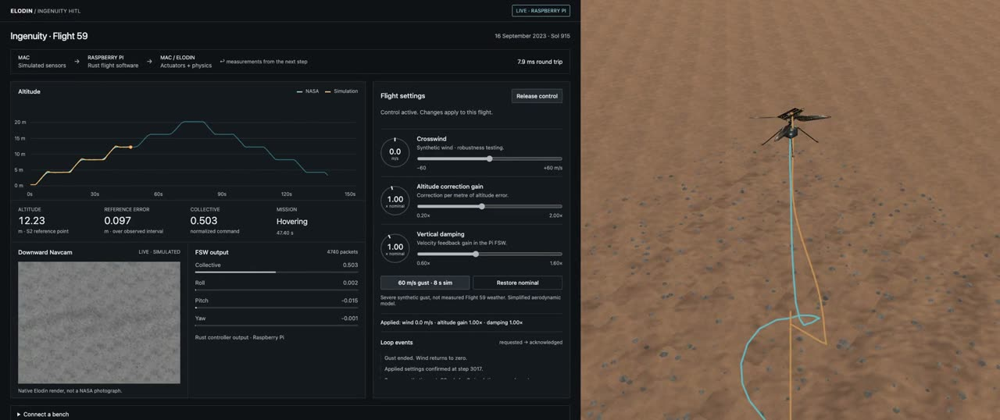
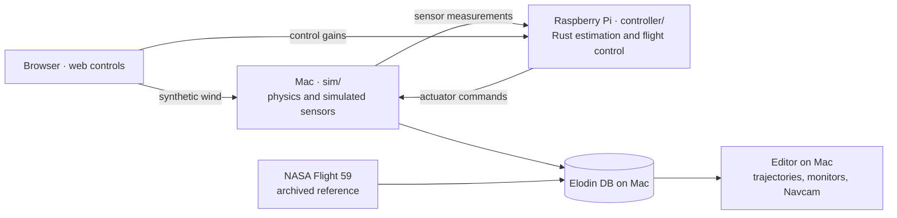

# Ingenuity-HITL

A Raspberry Pi flies a simulated Mars helicopter. Elodin runs the physics on a
Mac, sends noisy sensor measurements to independent Rust flight software on the
Pi, and applies its actuator commands to the next simulation step. The Editor
compares the resulting flight with NASA Ingenuity **Flight 59 — 16 September
2023, sol 915**.

This standalone application uses the released Python SDK and installed Elodin
binaries, without building or depending on the Elodin source tree.

## Watch the experiment

[](https://github.com/elodin-sys/Ingenuity-HITL/releases/download/flight59-web-control-demo/Ingenuity-Flight59-Web-Editor-EN-discord.mp4)

[Watch / download the demo](https://github.com/elodin-sys/Ingenuity-HITL/releases/download/flight59-web-control-demo/Ingenuity-Flight59-Web-Editor-EN-discord.mp4)
— 3 min 52 s, English annotations, 9 MB.

The Mac simulates a drone on Mars while a Raspberry Pi computes flight commands
from simulated sensor measurements. A strong synthetic gust pushes the drone
off course, and the controller brings it back toward its commanded position.
Later, we reduce the altitude correction gain during a climb while keeping
vertical damping unchanged. The video shows the web controls and the Elodin
viewport together, comparing this robustness experiment with the NASA Flight 59
reference.

The 60 m/s gust is a **severe synthetic stress test**, not measured Flight 59
weather. The simplified aerodynamic model is not validated at that wind speed.
The altitude knob changes how strongly the controller corrects altitude error;
it does not change the altitude target. See [the experiment and its limits](docs/WEB_BENCH.md#interpreting-the-robustness-experiment).

## Interactive Raspberry Pi control desk

The Pi also serves a lightweight web interface with **crosswind, altitude correction gain
and vertical damping knobs**, a timed gust, applied-setting acknowledgments,
controller outputs, the NASA/simulated altitude comparison and the simulated
downward camera. Gain changes are consumed by the actual Rust controller on the
Pi; wind changes affect the Mac physics. An offline recording remains available
when the bench stops, with the controls disabled.

See [launch instructions and the web-loop diagram](docs/WEB_BENCH.md).
The static interface is compatible with GitHub Pages; live operation needs the
running Pi and Mac bench.

After completing the [closed-loop prerequisites](docs/CLOSED_LOOP.md), run from
the repository root:

```sh
nix develop
export INGENUITY_PI_HOST=your-pi-ssh-alias
export ELODIN_BIN=/absolute/path/to/elodin
./scripts/web_bench.sh
```

Open **http://127.0.0.1:8089/** for the controls. In another terminal, run
`elodin editor 127.0.0.1:2270` for the native viewport. Choose **Take control**;
the applied-setting acknowledgments show what the plant and controller actually
used. The launcher prepares assets, deploys the Pi services, starts the plant and
camera renderer, and records the flight.

To explore the bundled recording without hardware, serve the static page with
`uv run python -m http.server 8089 --directory web/dist`. Controls are disabled
in this preview, and the camera is a recorded still.

## Simulation / flight software split

The Python Elodin plant in [`sim/`](sim/) and the independent Rust flight software
in [`controller/`](controller/) run as separate processes on separate computers.
See the [architecture diagram](docs/ARCHITECTURE.md)
and [run instructions and model limits](docs/CLOSED_LOOP.md).



```text
sim/                      Mac: physics, actuators, simulated sensors, NASA comparison
controller/src/lib.rs     Pi: estimation, mission logic and feedback control
controller/src/transport.rs  Pi: bounded sensor/command TCP transport
controller/src/main.rs    Pi: executable startup and mission-plan loading
monte-carlo/              Mac: repeat and score closed-loop trials
replay/                   Legacy archive-replay documentation and entry points
```

The controller crate has no Elodin or Python dependency. Its control library has
no networking, filesystem access, or archive reader. Removing the controller
connection stops the simulation; there is no Python flight-control fallback.

### Processing steps and where they run

- **NASA reference — Mac:** load the measured Flight 59 trajectory, displayed in cyan.
- **Physics simulation — Mac, [`sim/`](sim/):** simulate the helicopter, Martian atmosphere, motors, and ground contact with Elodin.
- **Simulated sensors — Mac:** generate noisy altitude, attitude, and motion measurements, then send them to the Raspberry Pi.
- **Flight software — Raspberry Pi, [`controller/`](controller/):** the Rust program estimates the helicopter's state, follows the Flight 59 mission targets, and computes flight commands.
- **Command application — Mac:** apply the received commands to the simulated actuators, calculate the next vehicle state, and send new measurements back to the Pi. **This feedback loop runs throughout the flight.**
- **Recording — Elodin DB on Mac:** record simulated states, commands, estimates, and the NASA reference.
- **Visualization — Editor on Mac:** display the NASA trajectory in cyan, the Pi-controlled simulated trajectory in orange, their separation, spinning rotors, and the onboard camera view.
- **Monte Carlo — Mac:** repeat flights while varying pressure, temperature, wind, and sensor noise, using the same Rust controller. Select the best result based on reference-trajectory error and landing criteria. **Live winner visualization in the Editor remains to be integrated into this new mode.**

The Rust controller is demonstration flight software, not NASA's flight software.
The simulated sensors and camera are model outputs, not archived measurements.

### Run the closed loop

From the repository root, with native `elodin` and `elodin-db` installed:

```sh
nix develop
export INGENUITY_PI_HOST=your-ssh-alias
./scripts/closed_loop.sh pi
# Or run the same Rust controller locally:
./scripts/closed_loop.sh sitl
```

See [setup, tested scope and model limits](docs/CLOSED_LOOP.md). The original
`scripts/workshop.sh` runs **archive replay**, a separate mode described below.

## Data and coverage

**180 archived navigation states over 137.735 seconds** come from NASA's
[Mars 2020 HeliCam archive](https://pds-imaging.jpl.nasa.gov/beta/archive-explorer?bundle=mars2020_helicam&instrument=helicam&mission=mars_2020).
The PDS bundle DOI is [10.17189/1522845](https://doi.org/10.17189/1522845).
These are S2 IMU position/attitude estimates with the TELEMETRY solution,
sampled when navigation images were acquired. They are **not a 500 Hz flight log**.

Coverage is 2023-09-16 19:30:29.100465–19:32:46.835804 UTC. The first S2 height
is 0.547 m and the last is 3.280 m above the local G origin. The ascent, five
altitude plateaus up to approximately 20 m, and most of the descent are present.
**Liftoff and touchdown are not observed in these files.** The replay stops at
the last observation; no synthetic ground endpoints are added. The published
study used high-rate telemetry, but a public download of that telemetry has not
been located. We cannot yet provide a fully measured ground-to-ground replay.

Every raw label and its download URL/checksum is retained. Derived CSV and
provenance: [sol00915.csv](data/derived/sol00915.csv),
[sol00915.json](data/derived/sol00915.json). Raw downloads are ignored by Git;
they can be fetched again with the preparation command below. PDS release IDs
are part of download URLs, and indexed MD5 plus recorded SHA256 protect imports.

The display reference frame is Rx(pi) * HELI_G: forward-at-start / left / up,
not geographic ENU. Source quaternions, positions and clocks remain separate DB
channels. The NASA GLB's IMU-to-body alignment is illustrative. No weather from
another sol is substituted for Flight 59.

## What the archive replay Editor shows

- **Cyan:** original archived positions connected by straight segments. The
  helicopter moves using position interpolation and shortest-arc attitude SLERP.
- **Orange:** the best candidate found so far. The Pi computes 1000 seeded
  Monte Carlo trajectories **during playback**, comparing a new candidate at
  each calculation. The sphere marks the current winner's position. Its trail
  records the winner active at each instant; previous points are not rewritten.
  This model does not predict attitude. Model and archive share the same clock.
- **Monitors:** archive elapsed seconds, S2 height, current 3-D model/reference
  distance, current best calibration RMSE, evaluated candidate count and winner ID.
- **Navcam:** native simulated 640×480 gray8 images, target 10 FPS. These are
  rendered images, not NASA photographs. Camera calibration is approximate.
- **Ground:** a procedural megaripple based on the published takeoff-site
  description (about 1 m high, 6 m wide), with continuous regolith treatment and
  small stones. Its exact shape/orientation is not a measured Jezero DEM.
- **Sun:** approximate Mars24 direction from archived UTC/LTST and G-to-SITE
  rotation. Brightness and atmospheric scattering remain illustrative.

See [visual interpretation](docs/VISUALS.md) and [model limitations](docs/MODEL.md).
The Monte Carlo result is a conditional calibration on this same flight, not
an independently validated flight-dynamics model or recovered historical weather.
In archive replay mode, the Pi performs hardware replay; this is not closed-loop
HITL validation. The separate closed-loop mode is described above.

## Run the legacy archive replay

Run development commands from this repository root inside `nix develop`, using
`uv` for Python. Install native `elodin` and `elodin-db` binaries separately;
see [tested binaries](docs/BINARIES.md). The optional local `.tools/elodin` and
`.tools/elodin-db` are used when present. `ELODIN_BIN` and `ELODIN_DB_BIN` override
them. No SDK or numerical dependency is needed on the Pi.

Configure your own SSH alias using [Pi access](docs/RASPBERRY_PI.md). Credentials
and machine-specific access remain outside this repository.

```sh
nix develop
export INGENUITY_PI_HOST=ingenuity-pi
# Fetch source labels when regenerating/verifying data:
uv run scripts/datasets.py prepare sol00915
# First setup: download/convert the NASA model and regenerate local terrain:
uv run scripts/prepare_assets.py
# Select Flight 59, deploy, start DB + renderer + Editor, replay with live MC:
./scripts/workshop.sh
```

The launcher uses a fresh recording directory. Keep the Editor open to inspect
the timeline after playback. Close it or stop the launcher to stop its children.
Assets are ingested once into each new recording; old recordings retain their
original assets.

```text
Pi source CSV + incremental seeded 3-DOF campaign
    → native Impeller TCP over SSH reverse tunnel
    → ground Elodin DB :2250 → Editor
                            → assets HTTP :2251
                            → native render-server → navcam.gray → DB
```

The tunnel maps Pi localhost:12250 to ground localhost:2250. The DB listens only
on localhost. Replay timestamps are rebased to the current time; original source
timestamps are preserved as channels. TCP replay is not a hard real-time test.
The Pi application lives in `~/Ingenuity-HITL`; other Pi applications are untouched.

Individual launcher stages are `ground.sh`, `sensors.sh`, `editor.sh`, and
`pi_replay.sh` under `scripts/`. The Pi saves complete trajectory campaign results
to `~/Ingenuity-HITL/runs/trajectory-monte-carlo.json`.

## Verify and explore

```sh
uv run scripts/replay_helicam.py --dry-run
uv run --with elodin==0.19.2 python -m unittest discover -s tests -v
cargo test --manifest-path controller/Cargo.toml
cargo fmt --manifest-path controller/Cargo.toml -- --check
uv run ruff check scripts tests sim bench
uv run ruff format --check scripts tests sim bench
uv run scripts/export_navcam.py runs/YOUR-RECORDING --output runs/navcam.png
```

Raw-source tests require the NASA downloads. The older Flight 1/MEDA tests also
require `uv run scripts/fetch_sources.py`. Native DB export verification and
current results are documented in [verification](docs/VERIFICATION.md).

The 76-sol archive catalogue and selector remain available for later exploration:

```sh
uv run scripts/datasets.py list
uv run scripts/datasets.py refresh
uv run scripts/datasets.py select   # Interactive menu
./scripts/workshop.sh sol00061      # Another validated dataset
```

Only Flight 59 currently has the trajectory calibration. Other flights use the
earlier hover sensitivity calculation; their original sparse observations remain
separate from interpolated display states. Interpolation stops across gaps above
10 seconds. See [sources](docs/SOURCES.md) and [wire protocol](docs/PROTOCOL.md).

The optional `monte_carlo.py` is a separate ideal-hover sensitivity experiment.
The reconstructed Flight 1 transport profile in `prepare_demo.py`/`replay.py`
is explicitly synthetic and is never the default replay.

## Small repository

Runtime GLBs are ignored by Git. `prepare_assets.py` regenerates the Flight 59 close
terrain, unpacks the losslessly compressed distant and legacy close terrains, and downloads the
NASA helicopter (about 2 MB) before converting it to editor-compatible core glTF.
The first conversion uses Node/npm and pinned glTF Transform 4.5.1; subsequent
launches reuse local assets. `ground.sh` prepares missing assets automatically.
Original and final asset SHA256 checksums must match the recorded provenance.
No mesh simplification or texture quality reduction is applied.

The unused Mars globe is not distributed. Git LFS is not required. The Pi receives
scripts and flight data, excluding terrain, models and raw downloads. Runtime
assets, binaries, package caches and DB recordings still consume local disk space;
they are separate from the small Git repository.

The demo video is a GitHub Release attachment; only its small preview image is
stored in the repository. Cloning the code does not download the video.

## Publication

Source attribution is separate from the application's license. An application
license has not yet been selected. See [publication notes](docs/PUBLISHING.md).
