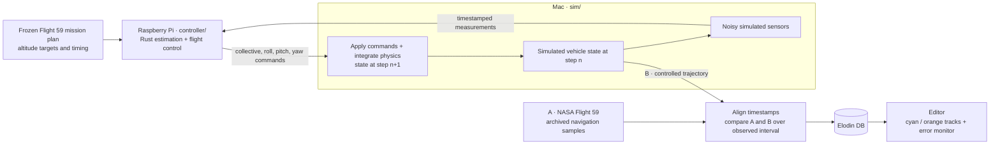
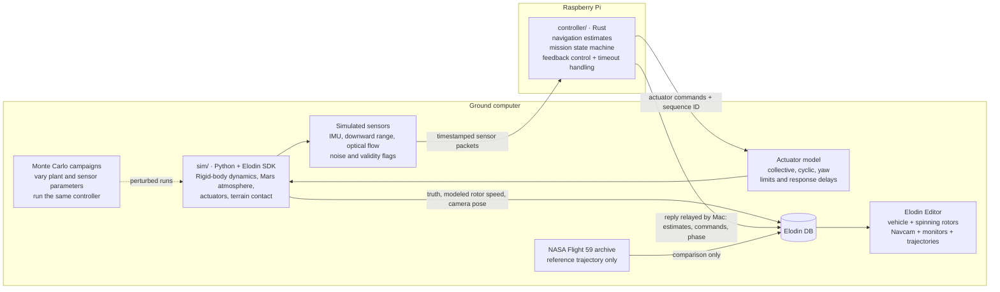

# Simulation and flight software

The original workshop remains a NASA navigation replay. The new closed-loop
mode separates the Mac Elodin plant from a Rust controller on the Pi. A complete
153.67-second simulated Flight 59 mission has been run through that loop, ending
in the landed state with zero collective. Model fidelity and real-time timing
remain limited; see `CLOSED_LOOP.md`.

## Reading the two trajectories

The primary comparison is **A: NASA Flight 59 navigation samples (cyan)** versus
**B: the Elodin plant controlled by the Raspberry Pi (orange)**. A is archived
flight data, not another simulation. B advances one step, sends noisy sensor
measurements to the Pi, receives commands, and applies them during the next step.
This repeats throughout the flight; there is no need to finish one simulation
before starting another. The frozen mission plan supplies the altitude targets.

Only the observed NASA interval contributes to the trajectory comparison.
Simulated startup and final touchdown extend beyond it and have no measured
NASA counterpart here. Comparing two simulations is a separate optional
experiment, for example local Rust versus the same Rust on the Pi, with identical
initial conditions and noise seed. Monte Carlo repeats B under varied assumptions;
its best fit is not a second measured flight or proof of the historical controller.

## Detailed implementation

## Boundary

The plant owns physical truth. The controller receives sensor measurements, not
the plant state or future NASA trajectory samples. It computes actuator commands;
the plant applies their physical effects. The external controller must be needed
to fly: disconnecting it must trigger the specified timeout behavior, not silently
enable a Python backup controller.

The same Rust control logic runs on the laptop for SITL and on the Pi for HITL.
Transport and telemetry adapters are separate from navigation and control.
The Navcam image is a simulated output; displaying it does not establish that
the controller performs image-based navigation. Any optical-flow sensor surrogate
must be explicitly distinguished from a vision algorithm consuming these images.

## Scientific scope

This is newly written demonstration flight software, not NASA Ingenuity's flight
software. The available NASA labels contain sampled navigation estimates, not
rotor RPM or historical actuator commands. A simulated ground-to-ground flight
must not be presented as a fully measured reconstruction of Flight 59.

Rotor animation in closed-loop mode follows modeled rotor speed. In archive
replay mode, any assumed animation speed must be labeled illustrative.

Monte Carlo calibration against the same flight is distinct from robustness
testing of the controller under independently varied model and sensor conditions.
The older replay and calibration tools remain available while the closed-loop
mode is developed and validated.

## Reference

[Rook Mk1 architecture](https://github.com/elodin-sys/rook-mk1/blob/main/docs/ARCHITECTURE.md)
illustrates the external-controller pattern. Its rocket dynamics and sensor
suite are not an Ingenuity model and are not copied as helicopter physics.
