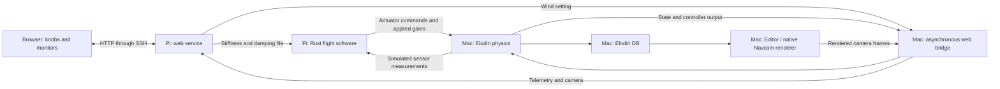

# Raspberry Pi web control desk

The website and its HTTP service run on the Raspberry Pi. The Rust flight
controller remains an independent process. The browser adjusts bounded experiment
settings; it never generates actuator commands.



## Run

Complete the [closed-loop prerequisites](CLOSED_LOOP.md) first: installed Elodin
binary, released Python SDK, prepared Flight 59 data, and a Pi with Rust, Python 3
and an SSH alias configured outside this repository. From the repository root:

```bash
nix develop
export INGENUITY_PI_HOST=your-pi-ssh-alias
export ELODIN_BIN=/absolute/path/to/elodin
./scripts/web_bench.sh
```

Open **http://127.0.0.1:8089/** on the Mac. During the flight, choose **Take control**
and change a knob. The applied values and acknowledgment events confirm what the
simulation and controller actually used. The script deploys the controller and
web files, establishes the SSH forwards, starts the Mac simulation and native
camera renderer, and saves the flight under `runs/web-flight59-*`.

The native Editor can connect separately to `127.0.0.1:2270`. Ports 8089, 12460,
2270, 2271 and 2272 must be free before starting. When the flight ends, the web
page switches to its bundled recording. Ctrl-C stops the launched services;
rerun the command for another experiment. Logs are in `runs/web-*.log`.

`scripts/web_pi.sh` starts only the Pi services and SSH forwards, for developers
who want to launch the Mac plant separately.

## What the knobs change

| Setting | Applied by | Limits |
| --- | --- | --- |
| Crosswind | Mac atmosphere / aerodynamic model | −60 to +60 m/s, 0.5 s response time |
| Altitude correction gain | Pi Rust position feedback gain | 0.20 to 2.00 × nominal |
| Vertical damping | Pi Rust velocity feedback gain | 0.60 to 1.60 × nominal |
| Gust | Pi timer requests Mac wind | +60 m/s for 8 simulation seconds |

The plant integrates at 100 Hz of simulation time. Wall-clock throughput depends
on the Mac, renderer and network; this is not a hard real-time guarantee. Web
telemetry runs independently at up to 10 Hz, with camera frames at up to 2 Hz.
The flight-control TCP exchange remains synchronous and separate from HTTP.

The Pi writes gains to `runs/web-controls.txt`. Its Rust transport adapter reads
this file every ten sensor packets and reports the applied gains with each
command. The control library has no filesystem or network dependency. The web
mode extends the normal ten-field response with two trailing gain multipliers;
the Mac requires those acknowledgments when `--web-url` is enabled.

One browser holds a 30-second control lease, renewed every eight seconds. Release
or expiry restores nominal settings. Gust expiry follows the reported simulation clock and is enforced by the Pi even if
the browser closes; wall-clock stalls do not shorten the experiment. Rust falls back to nominal gains when the control file is
over three seconds old. The Mac restores zero web wind after two seconds without
the relay. Stopping the FSW connection stops the simulation.

## Recording and publishing

For a demonstration video, show the browser next to the native Editor, take
control during ascent, change one gain, trigger a gust, and show the applied
values, actuator commands and trajectory response. Release control before
landing. Keep the live/replay badge visible.

The bundled web replay contains an actual complete Pi-controlled run, including
a synthetic 60 m/s gust followed by altitude correction gain 0.20×, with damping kept at 1.00×. It is downsampled for a
small download. Its camera is an explicitly labeled recorded still, not a
synchronized replay video. Complete telemetry and native images remain in the
local Elodin DB. NASA reference samples cover only the observed archive interval;
the exact ground endpoints are modeled, not NASA measurements. The model and
controller are demonstrators, not reconstructed NASA flight software.

`web/dist/` is a dependency-free static site suitable for GitHub Pages. Serving
it publicly does not expose the Pi automatically: live use from an HTTPS site
requires an HTTPS relay and an explicit allowed origin on `bench/server.py`.
The default launcher uses a loopback-only Pi service accessed through SSH.
It does not publish an Internet endpoint or configure GitHub Pages.

The bridge credential is generated on the Pi and copied to `.tools/web-bridge-token`
on the Mac with mode 0600. It is never embedded in JavaScript or committed.
The static payload contains no SSH credentials, GLB assets or full-size videos.

## Interpreting the robustness experiment

The gust is a **severe synthetic stress input**, not a reconstruction or a claim
about plausible weather during Flight 59. The model keeps its existing density
`pressure / (188.92 * temperature)` and effective drag area `CdA = 0.03 m²`.
At 700 Pa and 220 K, a 60 m/s relative wind initially produces about 0.91 N
of lateral drag. No direct displacement, visual trajectory offset or hidden
force multiplier is used. Aerodynamic response at this wind speed is not
validated against Ingenuity flight data.

The altitude correction knob multiplies the position-feedback coefficient:
`Kp = 2 * multiplier` in s⁻². It changes acceleration demanded per metre of
altitude error; it does not change the requested altitude or Martian gravity.
Reducing it from 1.00× to 0.20× reduces Kp from 2.0 to 0.4 s⁻². The velocity
feedback and integral term remain unchanged, so the comparison isolates this
coefficient rather than claiming that all aspects of the response are softened.
Film the gust and its recovery first, then change Kp before a later ascent,
keeping vertical damping at 1.00× throughout.

A measured 55-second Pi-controlled check of the 60 m/s gust produced 0.855 m
maximum lateral displacement and 12.0 degrees maximum tilt. Between simulation
seconds 50 and 54, lateral displacement stayed below 0.0061 m. These are results
of this simplified model and controller, not validation against a real gust.
